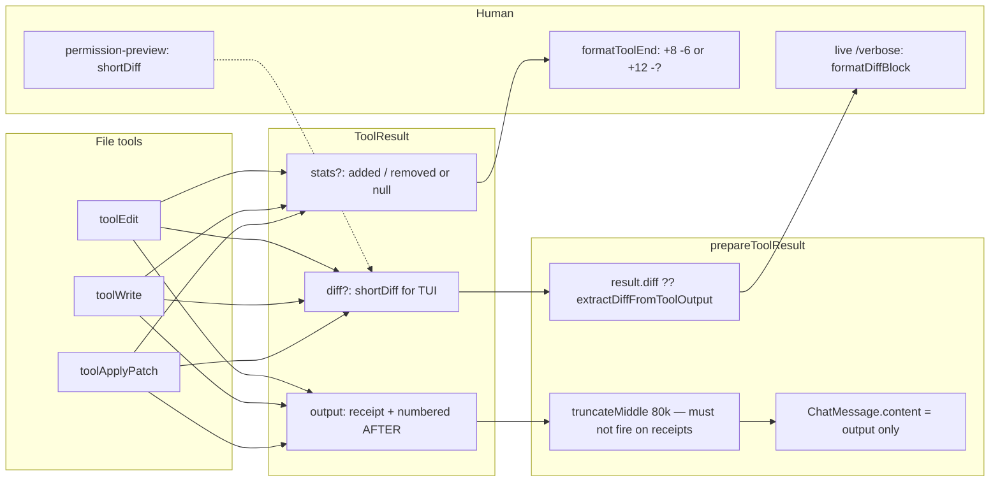

# Edit-result contract: stop inspect-after-edit waste

| Field | Value |
|---|---|
| **Status** | Draft |
| **Author** | Forge |
| **Date** | 2026-08-15 |
| **Audience** | Senior engineers shipping Forge file tools |
| **Codebase** | `/Users/s./code/hobby/forge-agent` (TypeScript, Node 20+, ESM) |

This document is the implementation contract for what `search_replace`, `write_file`, and `apply_patch` return to the model. It is **not** more ULW text, **not** poke-dedup, and **not** a new default edit protocol (no hashline-as-default, no Morph/fast-apply).

There is **one** PR list: [PR Plan](#pr-plan). The rollout narrative is that list; do not invent a second sequence.

---

## Overview

Forge already tells the model to trust `Edited path (N lines)`. That header worked: session `3b932edd-edb3-4f7a-813e-f4cf22aabe4c` (HUD-contract dogfood, grok-4.6; **author-asserted, not in this repo**) did **not** full-reread `src/tui/status-bar.ts` after 11 edits. The remaining cost scar is different. The model treats the tool body as **useless for the next exact `old_string`**, so it pages the file in 30–50 line `read_file` windows.

The body is `shortDiff()` (`src/agent/tools/edit-match.ts`): no `@@` line numbers, no context lines, a 40-line budget that a large deletion fills with only minuses, then the panic token `… [diff truncated]`. 23 of 27 successful `search_replace` results in that session contained that token (author-asserted). Mean edit-result size was 2328 bytes (max 12538). The TUI label `diff 1.3KB` in `formatToolEnd` (`src/util/format.ts`) is **human-only**; the model never sees it.

The architectural bug is audience coupling. Tools embed `shortDiff` in the model string; `prepareToolResult` (`src/agent/loop.ts:2901`) then parses it back out at **3319–3321** with `extractDiffFromToolOutput` by scanning for `\n\n--- a/` (`3311` is `truncateMiddle`, not the extract). Grok Build, OpenCode V2, and Pi all split these channels. Pi 0.11.5 even **reverted** verbose search/replace details after shipping them.

This design splits audiences (`ToolResult.diff` for the TUI, a receipt + numbered AFTER window for the model) so the next `old_string` can be copied without paging. Unread-first / file-read-guard, blocking Stop hooks, and proof-claim-guard are unchanged. A receipt is **not** a read.

The success header **keeps** parenthetical `(N lines)` so the live prompt (`src/agent/system-prompt.ts:218`, `src/harness/ulw-cycle.ts:1132`) stays true on day one, and the first default-on receipt PR also rewrites that one-liner.

---

## Background & Motivation

### What the model actually sees today

`toolEdit` (`src/agent/tools/edit.ts`) returns:

```
Edited src/tui/status-bar.ts (1080 lines)

--- a/src/tui/status-bar.ts
+++ b/src/tui/status-bar.ts
-lots of deleted lines...
… [diff truncated]
Tip: verify with `npm run typecheck`
```

`lineCountNote()` exists specifically “so a 1.3KB tool result is not mistaken for a truncated file.” It solved the **wrong** panic (full-file reread). It did not give the model a copyable next-edit surface.

`toolWrite` (`src/agent/tools/write.ts`) embeds the same `shortDiff` and has **no** `lineCountNote`. `toolApplyPatch` (`src/agent/tools/apply-patch.ts`) concatenates per-op `shortDiff(..., 30)` into the model string.

`shortDiff` is not a unified hunk:

```391:425:src/agent/tools/edit-match.ts
export function shortDiff(
  fileLabel: string,
  before: string,
  after: string,
  maxLines = 40,
): string {
  // ... equal-prefix skip, then only minuses then only pluses ...
  if (emitted >= maxLines) lines.push("… [diff truncated]");
```

On miss, `editMissHint` opens with **“Tips: re-read the file (read_file)”**. `applyUpdateChunks` (`src/agent/tools/patch.ts:282–304`) does the same.

`boundToolOutput` (`src/agent/tools/truncate.ts`) is **not** applied to edit tools (only bash/grep/read/web/etc.). Do not claim it is. The panic word is `shortDiff`’s `… [diff truncated]`. `prepareToolResult` only runs `truncateMiddle(result.output)` at 80k (`loop.ts:3311`) — not the 2.3KB issue.

### Measured waste (session `3b932edd`)

These numbers are **author-asserted** from the design prompt. The session JSON is not in this repository and could not be re-counted here. They motivate the work; they are **not CI ship gates**.

| Fact | Number |
|---|---|
| `read_file` | 91 |
| Full-file reads | 6 |
| Windowed reads | 85 |
| Unchanged-read stubs | 0 |
| Reads of files that were also edited | 78 |
| `src/tui/status-bar.ts` (~1080 lines) | 33 windowed, 0 full, 11 edits; 18 pre-first-edit, 15 post |
| Successful results containing `… [diff truncated]` | **23 / 27** |
| Mean edit-result bytes | **2328** (max 12538) |
| Immediate next tool after an edit | usually another `search_replace` (18), not a read |

Unchanged-read stub (`UNCHANGED_READ_STUB` in `src/agent/tools/read.ts`) only stubs a **full** reread when mtime/size match **and** `fullReadLines` is set **and** the last live `File:` body is still in the session. Writes call `noteFromDisk` (`src/agent/tools/file-read-state.ts:103–108`), which refreshes mtime/size **without** `fullReadLines`. Windowed reads are never stubbed. That is why 0 stubs fired: 85/91 reads were windowed, and writes changed bytes.

System prompt (`src/agent/system-prompt.ts:218`) and ULW (`src/harness/ulw-cycle.ts:1132`) already say “trust `Edited path (N lines)` / do not re-read to check truncation.” The prompt primed the model that truncation is a thing; the result still was not a usable next-edit surface.

### Prior art (local trees; treated as design input)

**Grok Build** (`/Users/s./AI coding/open source/grok-build/crates/codegen/xai-grok-tools/src/implementations/grok_build/search_replace/mod.rs:732–775`):

- Model channel: `"The file {} has been updated successfully."` / concise `"The file {} has been updated."`
- UI channel: `notification_handle.send_file_written` with **full** pre/post content
- Structured `edits` details live beside, not inside, `tool_output_for_prompt`
- Hashline is a **separate exclusive bundle** (`hashline_read` / `hashline_edit` / `hashline_grep`). Mixing with `read_file`+`search_replace` is rejected. Success of `hashline_edit` returns a **fresh-anchor snippet** (`SNIPPET_CONTEXT = 3`, merge nearby, `MAX_CONTIGUOUS_SNIPPET = 80`). Gap text is **ASCII** `... N lines not shown ...` and hashline **does** emit leading/trailing remainder gaps (`apply.rs:372–384`). This design uses Unicode `…` and **forbids** trailing remainder — do not copy hashline tests verbatim. Stale errors say use the fresh anchors — **do not re-read**.
- Codex `apply_patch` model output (`.../codex/apply_patch/tool.rs` `build_summary`): `"Success. Updated the following files:\nM path"`

**OpenCode V2** (`/Users/s./AI coding/open source/opencode/packages/core/src/tool/edit.ts:66–81`):

- `toModelOutput`: `"Edited file successfully: ${file}\nReplacements: N\n```diff\n"` + **6-line / 240-char echo of the ARGS** (`oldString`/`newString`), not a file-level dump
- Full `createTwoFilesPatch` lives on `Output.files` for UI
- `write.ts`: `"Wrote file successfully: ${resource}"` / `"Created file successfully: …"`
- `apply-patch.ts`: `"Applied patch sequentially:"` + `A|M|D` lines — no embedded file dump

**Pi** (`/Users/s./AI coding/open source/pi/packages/coding-agent/src/core/tools/edit.ts` ~362):

- Model content: `"Successfully replaced ${edits.length} block(s) in ${path}."`
- Diff in `details` for TUI only
- CHANGELOG **0.11.5** (2025-11-30): **reverted** verbose search/replace details to `"Edited file.txt"`
- Multi-hunk `edits[]` in one call (reduces sequential edit→reread). **Not** in Forge’s first ship.

**Claude Code**: closed core. Public lineage is Anthropic `str_replace` / text_editor: short “file has been updated,” numbered `view`, line `insert`. They do not dump a truncated file-level unified diff.

**GitHub community**: hashline ports (oh-my-pi, RimuruW/pi-hashline-edit, quangdang46/hashline, gtrak/hashline-tools), OpenCode #24511, Claude Code #25775, Hermes-agent #358. Shared invention: address lines by content hash; success hands back new anchors. Aider keeps whole files in chat. Cursor/Morph fast-apply is a second model — out of scope.

**Invariant everyone who got this right shares:** model string ≠ TUI diff.

---

## Goals & Non-Goals

### Goals

1. Give the model a **copyable next-edit surface** after every successful mutation: a receipt plus a numbered AFTER window in the same `N|` grammar as `read_file`.
2. Split audiences: model string never embeds `--- a/` / `… [diff truncated]`. Harness chrome (header, gap marker, clip suffix, verify-tip) `doesNotMatch` `/truncated|omitted|saved to/i`. The numbered AFTER **body** is file text and is **not** scanned. TUI `/verbose` and permission-ask previews keep colored diffs.
3. Same contract for `search_replace`, `write_file`, and `apply_patch` (reached at the end of PR 5; PRs 3–5 flip one tool each).
4. Miss path leads with closest **numbered** current lines; does **not** open with “re-read the file (`read_file`)”.
5. Format-on-write: window is **post-format** and the receipt says so. (Today `shortDiff` / `lineCountNote` use pre-format `next` — `N` can lie after prettier.)
6. Kill switch `FORGE_EDIT_RECEIPT=legacy` restores today’s model string for bisect.
7. Measure the scar in dogfood. Session `3b932edd` numbers are motivational, not merge gates.

### Non-goals (and why)

| Non-goal | Why |
|---|---|
| Hashline as default | Non-negotiable #6. Exclusive opt-in only, later, never mixed with `read_file`+`search_replace`. |
| Morph / fast-apply | Second model. Out of scope. |
| More ULW text | The prompt already talks about truncation; that primed the panic. This is a tool-result change. |
| Phase-5 poke / poke-dedup | Different speaker problem. Do not create a second harness poke. `verifyHintSuffix` stays a suffix on the **tool** result. |
| Weakening `blockingStopHooks` | Non-negotiable #1. |
| Letting a receipt replace the first `read_file` | Non-negotiable #2. Unread-first / file-read-guard stays. |
| Weakening proof-claim-guard | Non-negotiable #3. A receipt is not verification. |
| `edits[]` multi-hunk in one `search_replace` | Reduces sequential edit→reread (Pi). Separate PR. |
| Stubbing `read_file` windows covered by the last receipt | High value, easy to get wrong vs unread-first. Separate PR after the receipt is stable. |
| Real `@@` hunks in human `shortDiff` | TUI-only polish. Permission preview keeps working either way. |
| Applying `boundToolOutput` to edit tools | Not the 2.3KB issue. Do not add `saved to ~/.forge/tool-output` on a successful complete write. |
| Persisting `diff` on `ChatMessage` | Session schema is `role` + `content` + `tool_call_id`. TUI diffs are live-only (Grok/Pi/OpenCode). |
| Changing `shortDiff` semantics for permission asks | `src/agent/permission-preview.ts` must keep working in PR 1. |
| `FORGE_EDIT_RECEIPT=brief` | Not in v1. Parser does not accept it. |
| Adding a new `(created)` qualifier on `write_file` | Today only `(created parent directories)`. Do not invent `(created)`. |

### Non-negotiables (restated)

1. `blockingStopHooks` stays true. Stop/SubagentStop timeout/error fail closed.
2. Unread-first / file-read-guard stays. Mutations still require a prior `read_file` this session.
3. Proof-claim-guard stays (`verificationPassed` required to claim tests pass).
4. ESM-only, strict TS, `node:test` via `tsx --test`, small focused modules.
5. Sensitive JSON under `~/.forge` stays mode `0600`.
6. Do not invent a new default edit protocol.
7. Comments short and factual. No leftover-chrome grinding.

---

## Key Decisions

| # | Decision | Rationale |
|---|---|---|
| K1 | **Hybrid receipt + numbered AFTER window**, not confirmation-only and not hashline. | Grok/Pi confirmation-only would regress the stated scar: the model chained edits, then paged because it could not copy the next `old_string`. OpenCode’s arg-echo is the *before* text the model just sent, not the file after format/fuzzy match. Hashline’s fresh-anchor snippet is the right *shape*; we reuse line numbers we already have. |
| K2 | **`ToolResult.diff` + `ToolResult.stats` are TUI-only.** Model string is `output` only. | Fixes the `extractDiffFromToolOutput` coupling. Matches Grok / OpenCode / Pi. `LoopEvents.onToolEnd` already has `diff?: string` (`loop.ts:202`); PR 1 *prefers* `result.diff`, it does not invent the channel. |
| K3 | **Window is AFTER text, numbered like `read_file` (`padStart(6)+\|`). `N` = `splitFileLines(after).length`.** | `stripReadFileLinePrefixes` already accepts this. The next `old_string` is a paste, not a reconstruction from minuses. |
| K4 | **Harness chrome never says `truncated` / `omitted` / `saved to`.** That ban applies to the header, gap marker, clip suffix, and verify-tip only — **not** the numbered file body. Gap marker is `… N lines not shown …`. Clip suffix is `... (line clipped to 2000 chars)` — **not** `read_file`’s `truncated` phrase. Do not change `read_file`. No runtime sanitizer. Fixture tests only. | The panic token in `3b932edd` was `… [diff truncated]`. Scanning whole `output` would fail a successful edit of `src/util/format.ts` (`omitted` / `truncated` / `saved to` live in this repo). |
| K5 | **`diff` / `stats` are ephemeral.** Only `output` is stored on the tool message. After resume, `/verbose` reprints **receipt text**, not a colored `shortDiff`. | `ChatMessage` has no extra fields (`providers/types.ts:20–27`). There is no session replay of `onToolEnd`. |
| K6 | **Format-on-write window is post-format.** Shared helper `readAfterFormat`. On re-read failure, force the header off `(formatted with …)` and onto `(format NAME skipped: re-read failed)`. | Today `lineCountNote(next)` is pre-format. A receipt that claims formatted while showing pre-prettier text causes the next exact match to miss. |
| K7 | **A receipt is not a read.** Do not set `fullReadLines`. `noteFromDisk` still clears it. | Preserves unread-first. First ship does **not** stub windowed `read_file` covered by a receipt. |
| K8 | **Miss path leads with numbered current lines; delete the old `L{n}:` closest list.** Do not open with “re-read (`read_file`)”. | One location grammar (`N|`). The old first line was an instruction to spend a tool call. |
| K9 | **`FORGE_EDIT_RECEIPT=legacy` kill switch.** Default is the new contract. **Legacy always sets `result.diff`** to the **same pre-format `shortDiff` embedded in `output`**. Receipt path sets `result.diff` to post-format `shortDiff`. | Bisect of the model channel must be byte-stable. TUI in legacy matches what the model sees. `brief` is **not** in the v1 parser. |
| K10 | **`stripReadFileLinePrefixes` refuses to strip unless parsed `N` values are contiguous and strictly increasing by 1.** Gap markers stay non-`N|` (so a paste that includes them already fails). Dropping the gap and concatenating two runs must also fail. | Silent wrong `old_string` if the model copies both windows and deletes the chrome line. |
| K11 | **Per-file and `apply_patch` global window budget: 80 lines / 4000 UTF-8 bytes** (`REQUEST_PRUNE_DEFAULT_SOFT_CHARS`). Age-0 receipts stay intact; older receipts are not mutilated by `\n\n…\n\n` soft-trim. | 8KB windows would be cut on any turn older than `keepTurns` (default 3). The next `old_string` is age-0; going back to an earlier site must still see a well-formed window. |
| K12 | **No new default edit protocol.** `search_replace` / `write_file` / `apply_patch` stay. | Hashline exclusive opt-in is a later, separate design. |
| K13 | **Header keeps `(N lines)`.** Shape: `Edited rel (N lines) · −X +Y · lines A–B of N`. Prompt/ULW one-liner ships in the **same PR** as the first default-on receipt (PR 3). | Avoids a window where the model is still primed to look for `(N lines)` and no longer receives it. |
| K14 | **`stats.removed` is `number \| null`.** Model-facing receipt header **must** use Unicode minus `−` (U+2212) and en-dash `–` (U+2013): `· −X +Y · lines A–B of N`. TUI size field is ASCII hyphen only: `+8 -6`, `+12 -?`. Never emit `−0` / `-0` for a skipped pre-image. | Final (2026-08-15): not a preference and not a test-driven downgrade. Chalk/TUI must not require U+2212. Lock ASCII strings in `format-tool-status.test.ts`; lock Unicode header glyphs in `tests/edit-receipt.test.ts`. |
| K15 | **Diff algorithm is Myers O(ND) only.** If `a.length + b.length > 20_000` or `D > 4000` before the trace finishes, emit **one** hunk from the first mismatch through EOF on both sides, then let `selectAfterWindows` shrink. No `shortDiff` greedy fallback. | `shortDiff` without its 40-line abort becomes one replace-to-EOF on almost every mid-file edit. One algorithm + one abort + goldens. |

---

## Proposed Design

### Audience split



`permission-preview.ts` never goes through `ToolResult`. It keeps calling `shortDiff` in memory before the write. That path is unchanged in the first ship.

### New module: `src/agent/tools/edit-receipt.ts`

Small, focused. Public surface:

```ts
/** `"legacy"` only for legacy\|0\|false\|off\|no\|old. Everything else (including unset) is `"new"`. No `brief`. */
export function editReceiptMode(): "new" | "legacy";
export function editReceiptEnabled(): boolean; // mode === "new"

export const EDIT_RECEIPT_CONTEXT = 8;
export const EDIT_RECEIPT_MAX_LINES = 80;
export const EDIT_RECEIPT_MAX_BYTES = 4000; // REQUEST_PRUNE_DEFAULT_SOFT_CHARS
export const EDIT_RECEIPT_MERGE_GAP = 16;   // 0-based half-open AFTER coords
export const EDIT_RECEIPT_HEADER_RANGES = 3;
export const EDIT_RECEIPT_LINE_CLIP = 2000;
export const EDIT_RECEIPT_CLIP_SUFFIX = "... (line clipped to 2000 chars)";
export const EDIT_RECEIPT_MYERS_MAX_SUM = 20_000;
export const EDIT_RECEIPT_MYERS_MAX_D = 4000;

export type LineHunk = {
  /** 0-based, half-open, before-file. */
  aStart: number;
  aEnd: number;
  /** 0-based, half-open, after-file. */
  bStart: number;
  bEnd: number;
};

/** Same as read_file: text === "" ? [] : text.split("\\n") */
export function splitFileLines(text: string): string[];
export function lineCount(text: string): number; // splitFileLines(text).length

/** Myers O(ND). See procedure below. */
export function lineHunks(before: string, after: string): LineHunk[];

export function lineStats(hunks: LineHunk[]): { added: number; removed: number };

export type AfterWindow = { start: number; end: number }; // 1-based inclusive, AFTER

/** Internal to `selectAfterWindows` — not part of `AfterWindow`. */
export type MergedRange = {
  /** Expanded 0-based half-open AFTER range. */
  start: number;
  end: number;
  /** Union of member hunk cores, 0-based half-open (`coreStart === coreEnd` = hole). */
  coreStart: number;
  coreEnd: number;
};

/**
 * Sole window selector. `maxLines` / `maxBytes` default to the constants;
 * `budgetPatchWindows` passes leftovers.
 */
export function selectAfterWindows(
  hunks: LineHunk[],
  afterLineCount: number,
  opts?: { maxLines?: number; maxBytes?: number; afterLines?: string[] },
): AfterWindow[];

export function formatNumberedLines(
  afterLines: string[],
  windows: AfterWindow[],
): string;

/** UTF-8 byte length of formatNumberedLines (gap markers included, no header). */
export function numberedWindowBytes(
  afterLines: string[],
  windows: AfterWindow[],
): number;

export type ReceiptKind = "edit" | "write" | "patch-add" | "patch-delete" | "patch-update";

export type ReceiptHeaderInput = {
  kind: ReceiptKind;
  rel: string;
  moveRel?: string;
  lines: number;
  added: number;
  removed: number | null; // null → "−?"
  windows: AfterWindow[];
  matchNote?: "line_trimmed" | "block_anchor";
  replaceAllCount?: number;
  createdParents?: boolean;
  formatted?: string;
  formatSkipped?: string;
  strippedPrefixes?: boolean;
  preimageSkipped?: boolean;
  deleted?: boolean;
};

export function formatReceiptHeader(input: ReceiptHeaderInput): string;

export type BuiltReceipt = {
  output: string;
  diff: string;
  stats: { added: number; removed: number | null };
};

export function buildSuccessReceipt(opts: {
  header: ReceiptHeaderInput;
  after: string;
  before: string;
  relForDiff: string;
  verifyTip?: string;
  windows?: AfterWindow[];
  maxLines?: number;
  maxBytes?: number;
}): BuiltReceipt;

/** apply_patch only. See budgetPatchWindows. */
export type PatchOpReceipt = {
  kind: "add" | "delete" | "update";
  rel: string;
  moveRel?: string;
  before: string;
  after: string; // dest body for move; "" for delete
  formatted?: string;
  formatSkipped?: string;
};

export function budgetPatchWindows(
  ops: PatchOpReceipt[],
  opts?: { maxLines?: number; maxBytes?: number },
): AfterWindow[][]; // parallel to ops; delete → []

export function buildPatchReceipt(opts: {
  ops: PatchOpReceipt[];
  verifyTip?: string;
}): BuiltReceipt;

/**
 * Post-format re-read used by edit / write / apply_patch.
 * Returns edit-match text (BOM stripped). Does not change read_file.
 */
export function readAfterFormat(abs: string): { text: string; bom: string };
```

Do **not** put receipt grammar in `edit-match.ts`. That file stays match/miss/`shortDiff`/`strip`.

`lineCountNote` is **not** used on the receipt path (including the CRLF retry in `toolEdit` at `edit.ts:236–240`). `lineCount()` is the only counter.

### Line splitting (must match `read_file`)

`read_file` (`src/agent/tools/read.ts:436`):

```ts
const lines = content === "" ? [] : content.split("\n");
```

```ts
export function splitFileLines(text: string): string[] {
  return text === "" ? [] : text.split("\n");
}
export function lineCount(text: string): number {
  return splitFileLines(text).length;
}
```

- `""` → 0 lines.
- `"\n"` → `["", ""]` → 2 lines.
- `"created\n"` → `["created", ""]` → **2** lines. (`apply_patch` add forces a trailing newline — `apply-patch.ts:133`.)
- `"a\r\nb\r\n"` → `["a\r", "b\r", ""]` → 3 lines (same as `read_file`; `\r` stays on the line text).

Do **not** use `lineCountNote`’s `split(/\r?\n/)` for windows or `N`.

Numbering, copied from `read.ts:447–454`, except the clip suffix (K4):

```ts
const body =
  line.length > EDIT_RECEIPT_LINE_CLIP
    ? line.slice(0, EDIT_RECEIPT_LINE_CLIP) + EDIT_RECEIPT_CLIP_SUFFIX
    : line;
`${String(lineNo).padStart(6)}|${body}`
```

`read_file` keeps `... (line truncated to 2000 chars)`. This ship does **not** change `read_file`.

### 0-based → 1-based conversion (one sentence)

A 0-based half-open AFTER range `[s, e)` with `e > s` becomes 1-based inclusive `AfterWindow { start: s + 1, end: e }`; a 0-width hole `[s, s)` is expanded **before** conversion and therefore never emitted as an empty window.

Worked hole: delete 200 lines so the AFTER join is 0-based index 48. Expand `CONTEXT=8`: `[max(0,48-8), min(afterLen,48+8))` = `[40, 56)` = 16 lines → `{ start: 41, end: 56 }` → `lines 41–56`. (The earlier draft’s `40–56` was 17 lines and is **wrong**.)

### `lineHunks` — Myers only

Implement Eugene Myers, “An O(ND) Difference Algorithm and Its Variations” (1986), line-level:

1. `a = splitFileLines(before)`, `b = splitFileLines(after)`.
2. If `a.length + b.length === 0`, return `[]`.
3. If `a.length + b.length > EDIT_RECEIPT_MYERS_MAX_SUM`, skip to step 6.
4. Run Myers: `V`/`snake` trace, `D` from 0..`EDIT_RECEIPT_MYERS_MAX_D`. A snake is the longest run of equal lines (`a[x] === b[y]`) along a diagonal.
5. If the trace completes, walk it backwards to emit insert/delete/replace edits, then **coalesce** adjacent edits that touch into `LineHunk`s (`aStart,aEnd,bStart,bEnd` 0-based half-open). Return those hunks.
6. **Abort hunk (deterministic):** let `x,y` be the first index where `a[x] !== b[y]` (or `x===a.length` / `y===b.length`). Return exactly one hunk `{ aStart: x, aEnd: a.length, bStart: y, bEnd: b.length }`. `selectAfterWindows` then applies P1 head+tail.

Hunk kinds:

- Pure insert: `aStart == aEnd`, `bEnd > bStart`.
- Pure delete: `bStart == bEnd`, `aEnd > aStart`.
- Replace: both sides non-empty.

`lineStats`: `added = Σ (bEnd - bStart)`, `removed = Σ (aEnd - aStart)`.

Do **not** use `shortDiff`’s greedy two-pointer as a hunk source.

### `selectAfterWindows` — one procedure

Inputs: `hunks`, `afterLineCount`, optional `afterLines` (required when enforcing the byte cap), `maxLines` (default 80), `maxBytes` (default 4000).

Intermediate `MergedRange`s stay **0-based half-open**. `AfterWindow` is 1-based inclusive and has **no** core fields — cores live only on `MergedRange`.

**Step 1 — cores.** For each hunk, build a `MergedRange`:

- `coreStart, coreEnd` = `[bStart, bEnd)` if `bEnd > bStart`, else `[bStart, bStart)` (0-width AFTER join).
- `start = max(0, coreStart - CONTEXT)`, `end = min(afterLineCount, coreEnd + CONTEXT)` (expand).

**Step 2 — sort.** Sort by `start`.

**Step 3 — merge.** Merge `next` into `prev` iff `next.start <= prev.end + MERGE_GAP` (0-based half-open). Adjacent (`next.start == prev.end`) merges. A 16-line gap merges; a 17-line gap does not. On merge:

- `prev.end = max(prev.end, next.end)`
- `prev.coreStart = min(prev.coreStart, next.coreStart)`
- `prev.coreEnd = max(prev.coreEnd, next.coreEnd)`

**Step 4 — empty after.** If `afterLineCount === 0`, return `[]`.

**Step 5 — convert** each remaining `MergedRange` with `e > s` to a 1-based `AfterWindow` via `{ start: s + 1, end: e }`, **keeping the `MergedRange` list in parallel** (same order, same length). Drop a pair only if `end === start` after expand (should not happen unless `afterLineCount === 0`).

**Step 5b — empty windows.** `if (windows.length === 0) return []`. This is G2 (`hunks = []`, `afterLineCount > 0`). Do **not** evaluate `last.end - first.start` on an empty list.

**Step 6 — single span if it fits.** Let `spanLines = last.end - first.start + 1` (1-based inclusive). If `spanLines <= maxLines` **and** (`afterLines` missing **or** `numberedWindowBytes` of the filled span `[{first.start, last.end}]` `<= maxBytes`): return **one** window `{ start: first.start, end: last.end }` (gaps between sites are filled — the model can copy one run).

**Step 7 — shrink, in this order, until both line count of *emitted* windows `<= maxLines` and numbered UTF-8 bytes `<= maxBytes`.**

`emittedLineCount(windows)` = `Σ (w.end - w.start + 1)`.
`coreLen(m)` = `m.coreEnd - m.coreStart`.

**P1 — oversized core (large insert / create / merged replace_all).** For each `MergedRange` whose `coreLen > maxLines - 2*CONTEXT` (treat `maxLines - 2*CONTEXT < 0` as “core is oversized”), replace that range’s window(s) with a head+tail split. Apply from **largest `coreLen` to smallest**.

Compute context from the **core vs the expanded range** — never from a `windowStartEquivalent` (that name is deleted):

```
ctxBefore = m.coreStart - m.start    // ≥ 0; already clamped by expand
ctxAfter  = m.end - m.coreEnd        // ≥ 0
R = maxLines - ctxBefore - ctxAfter
    // if other windows already occupy budget:
    //   R = maxLines - emittedLineCount(otherWindows) - ctxBefore - ctxAfter
```

Insert 200 lines at offset 0 into an 8-line tail (`afterLen = 208`): `core = [0,200)`, expand `[0,208)`, `ctxBefore = 0`, `ctxAfter = 8`, `R = 72` → `1–36` / `165–208`. Treating the expanded window as the core (`R = 80` → `1–40` / `169–208`) is **wrong**.

**If `R < 0`** (leftover `maxLines` from `budgetPatchWindows` can be 1–15; `2*CONTEXT = 16`):

- Set `ctxBefore = 0`, `ctxAfter = 0`.
- If `coreLen > 0` (insert / create / replace): keep `min(maxLines, coreLen)` lines from **core start**: 0-based `[coreStart, coreStart + keep)` → one window.
- If `coreLen === 0` (pure-delete hole): keep `min(maxLines, 2*CONTEXT)` lines centered on the hole, clamped to `[0, afterLineCount)` (same expand formula with `CONTEXT' = floor(keep/2)`).

**If `R >= 0`:**

- `headCore = floor(R / 2)` lines from the start of the core; `tailCore = ceil(R / 2)` lines from the end of the core.
- If the two core slices overlap or abut: one window covering ctxBefore + core + ctxAfter clamped to `maxLines`.
- Else: two windows `(ctxBefore + headCore)` and `(tailCore + ctxAfter)` with an interior gap marker at format time.

**P2 — still over `maxLines` (many small windows).** Keep the **first** and **last** window only. Drop the middle (one gap at format time). If first+last still exceed `maxLines`, trim each window from the **interior** side (the side facing the other window), one line at a time, never dropping the outermost line of either window until that window would be empty (then drop the whole window only if the other still has ≥1 line).

**P3 — byte cap** (runs after P1/P2, and also when step 6’s filled span failed the byte test). While `numberedWindowBytes(afterLines, windows) > maxBytes` and at least one window has more than 1 line:

1. Pick the **largest** window (most lines; tie → later window).
2. Drop one line from its **interior**: if the window sits before a gap (or is the first of a head+tail pair), drop its last line; if it sits after a gap, drop its first line; if it is the only window, drop the middle index `start + floor((end-start)/2)` (the dropped line becomes a 1-line hole → split into two windows, or if that would create a 0-line side, just shrink that side).
3. Never leave zero windows when `afterLineCount > 0` and we originally had hunks; keep at least one line.

If `afterLines` is omitted, P3 is skipped (unit tests that only check line ranges may omit it; production callers always pass `afterLines`).

**Step 8 — return** the remaining 1-based windows, sorted by `start` (drop internal `MergedRange`s). Header span uses these emitted windows: at most `EDIT_RECEIPT_HEADER_RANGES` (3), then `+K more`.

### Gap marker

Exactly one form, entire line, no `N|` prefix:

```
… 42 lines not shown …
```

Unicode `…` (U+2026). Count is the number of AFTER lines between the previous window’s `end` and the next window’s `start` (`next.start - prev.end - 1`).

**No** leading remainder gap before the first window. **No** trailing remainder gap after the last window. Interior gaps only. (Hashline emits leading/trailing ASCII `... N lines not shown ...`; we do not.)

### Header range clause

Derived from **emitted** windows:

- One window: `lines A–B of N`
- Two or three: `lines A–B, C–D of N`
- More than three: `lines A–B, C–D, E–F +K more of N`
- No windows (empty after / delete): omit the `lines …` clause.

`N` is `lineCount(after)` and **must** equal a subsequent `read_file` of that path (`File: rel (N lines, …)`), modulo BOM on line-1 **text** (see format re-read).

### Golden fixtures (PR 2 must encode these)

All `before`/`after` use `splitFileLines`. Implementers should copy these into `tests/edit-receipt.test.ts`.

**G1 — small exact replace (5-line file, trailing newline).**

```
before = "export function f() {\n  const x = 1;\n  return x;\n}\n"
after  = "export function f() {\n  const x = 2;\n  return x;\n}\n"
```

`lineCount` = 5. Hunk: replace 0-based line 1. Expand covers `[0,5)`. Windows: `[{start:1,end:5}]`. Header span `lines 1–5 of 5`. Stats `−1 +1`.

**G2 — identical.**

```
before = after = "a\nb\nc\n"
```

Hunks `[]`. Windows `[]`. Stats `−0 +0`. Header has `(4 lines)` and **no** `lines A–B` clause.

**G3 — 200-line delete.**

```
const afterArr = Array.from({ length: 880 }, (_, i) => `L${i + 1}`);
const after = afterArr.join("\n"); // 880 lines, no extra trailing empty
const before = [...afterArr.slice(0, 48), ...Array.from({ length: 200 }, (_, i) => `DEL${i}`), ...afterArr.slice(48)].join("\n");
```

Hole at 0-based 48. Windows: `[{start:41,end:56}]`. Header `lines 41–56 of 880`. Stats `−200 +0`. Window length 16. No `truncated`.

**G4 — 200-line insert** (swap G3 before/after).

Core `[48,248)`. P1: ctxBefore=8, ctxAfter=8, `R=64`, head=32, tail=32. Windows: `[{start:41,end:80},{start:217,end:256}]`. Interior gap `… 136 lines not shown …`. Header `lines 41–80, 217–256 of 1080`. Stats `−0 +200`.

**G5 — 500-line create.**

```
before = ""
after = Array.from({ length: 500 }, (_, i) => `C${i + 1}`).join("\n")
```

One insert `[0,500)`. ctxBefore=0, ctxAfter=0, `R=80`, head=40, tail=40. Windows: `[{start:1,end:40},{start:461,end:500}]`. Gap `… 420 lines not shown …`. Header `lines 1–40, 461–500 of 500`. Stats `−0 +500`.

**G6 — 50-site replace_all, no merge.**

After has 2000 lines `L1`…`L2000` joined by `\n`. Replace the single line at 1-based 21, 61, 101, … (every 40) — 50 sites. Each core is 1 line; expand ±8 → `[n-8, n+9)` 0-based; adjacent expanded starts are 40 apart, `40 > 16+windowLen` so they do **not** merge. Span ≫ 80 → P2 keeps first and last. Windows: first expanded site `[{start:13,end:29}]` (1-based 21 ±8) and last site similarly. Header: two ranges + `(50 occurrences)`. Stats `−50 +50`.

**G7 — byte cap (4 × 1200-char lines).**

```
const long = "x".repeat(1200);
before = [long, long, "old", long].join("\n") + "\n"
after  = [long, long, "new", long].join("\n") + "\n"
```

`lineCount` = 5. Step 6 would take the whole file (5 lines) but numbered bytes ≈ `5 * (6+1+1200)` = 6035 > 4000. P3 drops interior lines until `<= 4000`. Golden assertion: `numberedWindowBytes <= 4000`, at least one window remains, header `N` is still 5. Header + gap + clip suffix + verify-tip `doesNotMatch /truncated|omitted|saved to/i` (do **not** scan the `xxx…` body — this fixture happens not to contain those words).

**G8 — empty after (write empty / full delete).**

`after = ""`, `before = "a\nb\nc\n"` (4 lines). Windows `[]`. Header `(0 lines) · −4 +0` (or `· deleted · −4 +0` for patch delete). No window body.

**G9 — CRLF line *text* (count matches read_file).**

`after = "a\r\nb\r\n"` → `lineCount === 3`, window lines are `a\r`, `b\r`, `""`.

**G10 — Myers abort path.** A synthetic pair with `a.length + b.length > 20_000` and a first mismatch at index 0: exactly one hunk `{0, aLen, 0, bLen}`; `selectAfterWindows` then looks like G5 (head+tail of AFTER).

**G11 — insert 200 lines at start of file (`maxLines = 80`).** Pins core-vs-expand, not window-as-core.

```
const tail = Array.from({ length: 8 }, (_, i) => `T${i + 1}`);
const inserted = Array.from({ length: 200 }, (_, i) => `I${i + 1}`);
before = tail.join("\n")
after = [...inserted, ...tail].join("\n") // 208 lines
```

Core `[0,200)`, expand `[0,208)`, `ctxBefore = 0`, `ctxAfter = 8`, `R = 72`. Windows: `[{start:1,end:36},{start:165,end:208}]`. Header `lines 1–36, 165–208 of 208`. Myers is a pure insert at 0: stats `−0 +200`. (`lineCount(before)` = 8 with no trailing newline.)

**G12 — `maxLines = 10` on G4’s 200-line mid-file insert (`R < 0`).**

Same before/after as G4. `ctxBefore = 8`, `ctxAfter = 8`, `R = 10 - 16 = -6`. Rule: `ctxBefore = ctxAfter = 0`, keep `min(10, 200)` from core start `[48,58)` → one window `[{start:49,end:58}]`. Header `lines 49–58 of 1080`. Stats still `−0 +200`.

---

## Receipt grammar

Success only. Errors stay `isError: true` and do not use this grammar.

### Single-file (`search_replace` / `write_file`)

```
success      = header NL NL window [verify-tip]
             | header [verify-tip]                 ; no window (empty after)

header       = lead qualifier* line-count-note " · " stats [ " · " span ] format-note strip-note

lead         = "Edited " rel                         ; search_replace
             | "Wrote " rel                          ; write_file

qualifier    = " (created parent directories)"
             | " (matched via line_trimmed fallback)"
             | " (matched via block_anchor fallback)"
             | " (" INT " occurrence" ["s"] ")"      ; plural iff count !== 1
             | " (pre-image skipped)"

line-count-note = " (" INT " " line-word ")"
line-word    = "line" | "lines"                      ; "line" iff INT == 1; else "lines" (0 lines, 2 lines)

stats        = "−" removed " +" INT                  ; Unicode minus U+2212
removed      = INT | "?"                             ; "?" iff stats.removed === null

span         = "lines " ranges " of " INT
ranges       = range ( ", " range ){0,2} [ " +" INT " more" ]
range        = INT "–" INT                           ; en-dash U+2013

format-note  = " (formatted with " NAME ")"
             | " (format " NAME " skipped: " DETAIL ")"
strip-note   = " (stripped read_file line-number prefixes)"

window       = numbered-line (NL numbered-line | NL gap)*
numbered-line = pad6 INT "|" TEXT
gap          = "… " INT " lines not shown …"

verify-tip   = NL "Tip: verify with `" CMD "`"       ; verifyHintSuffix; docs skipped
```

Qualifier **order** (all optional, immediately after `rel`):

1. `(created parent directories)`
2. match note **or** replace_all count
3. `(pre-image skipped)`

Then `(N lines)`, then ` · −X +Y`, then ` · lines A–B of N`, then format-note, then strip-note. `verifyHintSuffix` last.

**Never** on harness chrome of a successful complete write (header, gap marker, clip suffix, verify-tip — case-insensitive): `truncated`, `omitted`, `saved to`, `[diff truncated]`, `Output truncated`. The numbered AFTER body is file text: an edit of `src/util/format.ts` may legally contain those words. **No runtime sanitizer.** Tests assert chrome on fixtures whose body cannot contain the words (G1–G12, temp-dir `executeTool` files). Do not `doesNotMatch` whole `output` on live repo files.

**Locked (2026-08-15):** model-facing receipt header uses Unicode minus `−` (U+2212) and en-dash `–` (U+2013). TUI size field stays ASCII (`+8 -6`, `+12 -?`). Do not downgrade the header to ASCII hyphens.

`formatNoteSuffix` today returns ` (formatted with ${formatter})`. Keep that string.

### `apply_patch` multi-file

```
patch-success = wrapper NL file-header (NL file-header)*
                [NL NL file-window (NL NL file-window)*]
                [verify-tip]

wrapper       = "Applied patch (" INT " op(s)):"

file-header   = patch-lead qualifier* line-count-note " · " stats [ " · " span ] format-note
              | "D " rel " · deleted · −" INT " +0"

patch-lead    = "A " rel
              | "M " rel
              | "M " rel " → " moveRel

file-window   = file-label NL numbered-block
file-label    = rel | rel " → " moveRel          ; not N|-prefixed
numbered-block = numbered-line (NL numbered-line | NL gap)*
```

`INT` in the wrapper is `ops.length` **after** collapsing same-dest ops (see below).

File labels are **not** `N|` lines. A paste of label + window does not strip (K10).

#### `budgetPatchWindows(ops)`

`ops` is **planned order** after collapsing (below).

```
remainingLines = EDIT_RECEIPT_MAX_LINES        // 80
remainingBytes = EDIT_RECEIPT_MAX_BYTES        // 4000
windows[i] = [] for every op

phase1 = indices of kind === "update" in planned order   // includes moves (dest after)
phase2 = indices of kind === "add" in planned order
delete → no window

for i in phase1 then phase2:
  if remainingLines <= 0 or remainingBytes <= 0: continue
  hunks = lineHunks(ops[i].before, ops[i].after)
  windows[i] = selectAfterWindows(hunks, lineCount(ops[i].after), {
    maxLines: min(EDIT_RECEIPT_MAX_LINES, remainingLines),
    maxBytes: min(EDIT_RECEIPT_MAX_BYTES, remainingBytes),
    afterLines: splitFileLines(ops[i].after),
  })
  remainingLines -= emittedLineCount(windows[i])
  remainingBytes -= numberedWindowBytes(splitFileLines(ops[i].after), windows[i])
```

Three updates that each want 80 lines: first gets `min(80, remaining)` (then shrinks to fit bytes); the rest are **receipt-only** (header, no window). Deterministic. Updates before adds. Planned order inside each phase.

`ToolResult.stats` for a patch is the **sum** of per-op `lineStats` (`removed` is `null` iff any op has unknown before — should not happen for patch; deletes use `lineCount(before)`).

#### Same-batch add-then-update / add-then-delete

Legal in `apply-patch.ts` (in-memory `planned[]`). Collapse **before** headers:

- Group by **final** absolute path (move dest if present).
- One header + at most one window per final path.
- `before` = first op’s before (empty for a pure add); `after` = last op’s after (empty if the last op deletes).
- Kind: last op wins (`delete` → `D`; else if any add without a pre-existing before → `A`; else `M`).
- Do not emit two headers for the same dest.

#### Format-on-write on a patch

- `readAfterFormat` the **dest** path (move dest, not source).
- Per-file `format-note` on that file’s header only. If 2 of 4 files format, only those 2 notes appear.
- If re-read fails: that file’s header uses `formatSkipped`, window from in-memory `after`.

---

## Worked examples

Examples use the G1–G8 goldens. Headers include `(N lines)`.

#### 1. Small exact `search_replace` (G1)

```
Edited src/a.ts (5 lines) · −1 +1 · lines 1–5 of 5
     1|export function f() {
     2|  const x = 2;
     3|  return x;
     4|}
     5|
Tip: verify with `npm run typecheck`
```

#### 2. `replace_all` (three nearby sites that merge, plus one far site)

If expand+merge yields two windows:

```
Edited src/a.ts (3 occurrences) (100 lines) · −3 +3 · lines 1–18, 72–88 of 100
     1|// header
     2|bar()
    18|  return;
… 53 lines not shown …
    72|function tail() {
    80|  bar()
    88|}
```

Fifty far sites: G6 (first+last only, `(50 occurrences)`).

#### 3. Fuzzy fallback

```
Edited m.ts (matched via line_trimmed fallback) (4 lines) · −1 +1 · lines 1–4 of 4
     1|export function f() {
     2|  return 2;
     3|}
     4|
```

`tests/tools-quality.test.ts` `/line_trimmed|Edited/` still matches.

#### 4. Format-on-write

```
Edited src/a.ts (40 lines) · −3 +5 · lines 10–23 of 40 (formatted with prettier)
    10|export function f() {
    11|  const x = 2;
    23|}
```

Re-read failure: ` (format prettier skipped: re-read failed)` and window = in-memory `next`.

#### 5. `write_file` create vs overwrite

Create (parents missing) — **no** new `(created)` qualifier:

```
Wrote nested/deep/file.ts (created parent directories) (2 lines) · −0 +2 · lines 1–2 of 2
     1|export const n = 1;
     2|
```

Overwrite:

```
Wrote nested/deep/file.ts (2 lines) · −2 +2 · lines 1–2 of 2
     1|export const n = 2;
     2|
```

#### 6. `write_file` empty file

```
Wrote empty.txt (0 lines) · −0 +0
```

No window. No `lines A–B`. Plural is `0 lines`.

#### 7. `write_file` overwrite, pre-image skipped

`snapshotForWrite` `skipped: true` (`mutations.ts:181–186`). `stats.removed === null`.

```
Wrote huge.log (pre-image skipped) (12 lines) · −? +12 · lines 1–12 of 12
     1|...
```

TUI: `+12 -?` (ASCII). Never `-0`. `result.diff` may be `""` (no before); `/verbose` then falls through to `formatToolOutputHead(output)` (receipt text).

#### 8. `apply_patch` multi-file (line counts match `read_file`)

Live add forces `"created\n"` → **2** lines. `"line1\nchanged\nline3\n"` → **4** lines. `"new content\n"` → **2** lines. `"bye\n"` deleted → `−1` if the file was `"bye\n"` (`["bye", ""]` is 2) — the current fixture is `bye\n` so **2** lines removed.

```
Applied patch (4 op(s)):
A nested/new.txt (2 lines) · −0 +2 · lines 1–2 of 2
D delete.txt · deleted · −2 +0
M modify.txt (4 lines) · −1 +1 · lines 1–4 of 4
M old/name.txt → renamed/dir/name.txt (2 lines) · −2 +2 · lines 1–2 of 2

nested/new.txt
     1|created
     2|

modify.txt
     1|line1
     2|changed
     3|line3
     4|

old/name.txt → renamed/dir/name.txt
     1|new content
     2|
Tip: verify with `npm run typecheck`
```

`tests/apply-patch.test.ts` `/Applied patch/` still matches.

#### 9. Large deletion (G3)

```
Edited src/big.ts (880 lines) · −200 +0 · lines 41–56 of 880
    41|L41
    48|L48
    49|L49
    56|L56
```

16 numbered lines. No 200 minuses. No `truncated`.

#### 10. Binary refusal — unchanged

`read_file` still refuses binary. Edit/write still write UTF-8. No new binary protocol.

#### 11. Numbered-prefix strip

```
Edited a.ts (2 lines) · −1 +1 · lines 1–2 of 2 (stripped read_file line-number prefixes)
     1|const x = 9;
     2|const y = 2;
```

---

## `stripReadFileLinePrefixes` (K10)

Keep today’s rules (`edit-match.ts:23–58`), then add:

After a successful numbered parse, collect the parsed integer `N` for every **numbered** line (skip blank lines that did not match — those already abort the parse today if they are non-empty non-`N|`). Refuse to strip (`stripped: false`, original text) unless the sequence is **contiguous and strictly increasing by 1** (`n[i+1] === n[i] + 1`).

Miss hint when `old_string` looks numbered but was not stripped for this reason:

```
copied lines are not a contiguous run (gap at L12→L80); copy one window only.
```

When `old_string` contains `… N lines not shown …` (or ASCII `... N lines not shown ...`): same sentence.

**Required tests** (`tests/tools-quality.test.ts` and/or `tests/edit-receipt.test.ts`):

| Paste | Strip? |
|---|---|
| Single contiguous run (`1` then `2`) | yes |
| Window + gap marker | no (gap is not `N|`) |
| Two windows, gap marker deleted (e.g. `1` then `18`) | no (non-monotonic / non-contiguous) |
| Header line + window | no (header is not `N|`) |
| apply_patch file label + window | no |
| Decreasing numbers | no |

Do **not** teach strip to skip gap-marker lines.

---

## Miss path

### `editMissHint`

**Delete** the old `Closest lines in file (re-read and copy exact text):` / `L{n}:` preview list. The new ±8 `N|` block replaces it.

**New lead** (no `read_file` in sentence 1):

```
old_string not found in file
File: src/foo.ts
Closest current lines (N| prefixes are not file text — copy a contiguous numbered run):
    40|export function greet(name: string) {
    41|  return `hello ${name}`;
    42|}
Add surrounding context so old_string is unique, or set replace_all.
```

Rules:

1. Empty file: today’s “File is empty — use `write_file`”. Do **not** lead with `read_file`.
2. Closest hit: **±8 numbered lines** around the best-scoring line (`padStart(6)|`). Clamp to file. Cap the numbered block at 80 lines / 4000 bytes (same constants; a 1-line file stays 1 line).
3. Drift notes stay **after** the numbered block.
4. Mixed-`N|` note stays. Non-contiguous parse (K10) uses the gap-at-Lx→Ly sentence.
5. `formatMultiMatchLocations` may keep `L{n}:` in v1 (multi-match is not the miss-hint lead). Optional later: `N|`.
6. Update `tests/tools-quality.test.ts:96`: assert `Closest current lines` and `padStart(6)|`; `doesNotMatch` `/Tips: re-read the file \(read_file\)/` and `doesNotMatch` `/L\d+:/`.

### `applyUpdateChunks` (`patch.ts:282–304`)

The thrown message still names the failure, but:

- **Lead** with a numbered ±8 window of the **pre-seek file** (`lines`) around:
  - `changeContext` miss: `lineIndex` (the current search cursor; if 0, start of file).
  - `oldLines` miss: `found === -1` → use `lineIndex`; if `lineIndex >= lines.length` (EOF), use the last `min(8, lines.length)` lines.
- Cap the raw `chunk.oldLines.join("\n")` dump at **20 lines** (then `…` **without** the words truncated/omitted/saved to — e.g. `… 12 more expected lines`).
- Do **not** start with `Tip: re-read`.
- Last clause may mention `search_replace` for a small edit.

Add **one** `tests/apply-patch.test.ts` case: failed hunk `doesNotMatch` `/Tip: re-read/` and matches `padStart(6)|`.

---

## Format-on-write integration

Live order (confirmed): `atomicWrite` → journal → `maybeFormatAfterWrite` (`spawnSync`) → `noteFromDisk` → `shortDiff`/`lineCountNote` on **pre-format** `next`/`body`/`op.content` (`edit.ts:263–276`, `write.ts:122–130`, `apply-patch.ts:438–465`).

**`readAfterFormat(abs)`** — used by all three tools:

```ts
export function readAfterFormat(abs: string): { text: string; bom: string } {
  const raw = fs.readFileSync(abs, "utf8");
  return splitBom(raw); // same as toolEdit
}
```

- Window + `lineHunks` + `N` use `text` (BOM stripped) so the next `old_string` matches `locateEdit`.
- `read_file` does **not** `splitBom`. Line **count** still matches (BOM is not an extra line). Line **1 text** in a later `read_file` may start with U+FEFF; the receipt window will not. Document that; do not BOM-strip `read_file` in this ship.
- If `fmt?.ok` and `readAfterFormat` throws: `after = next` (in-memory pre-format), **header override**: do not emit `(formatted with NAME)`; emit `(format NAME skipped: re-read failed)`.
- If `fmt` is null or `fmt.ok === false`: `after = next`; existing `formatNoteSuffix` for skip/fail.

**Legacy path:** model `output` is today’s string (pre-format `shortDiff` embedded). **`result.diff` is that same pre-format `shortDiff`** (K9). Do not post-format the TUI in legacy.

**Receipt path:** `result.diff = shortDiff(rel, before, after)` with post-format `after`.

---

## Kill switch

```ts
export function editReceiptMode(): "new" | "legacy" {
  const v = (process.env.FORGE_EDIT_RECEIPT || "").trim().toLowerCase();
  if (v === "legacy" || v === "0" || v === "false" || v === "off" || v === "no" || v === "old") {
    return "legacy";
  }
  return "new";
}
```

`brief` is not special — it falls through to `"new"`. Do not document `brief`.

Default **on**. Surface on `/config` and `forge doctor`. Do **not** add a `productionWarnings` entry.

Doctor / `collectConfigSnapshot().env` (`slash.ts:7736–7746`) is a **fixed typed object**. Add:

```ts
FORGE_EDIT_RECEIPT: "new" | "legacy";
```

Not a boolean. Update `tests/project-intel.test.ts` (it already asserts `snap.env.FORGE_FILE_READ_GUARD`).

---

## API / Interface Changes

### `ToolResult` (`src/agent/tools/types.ts`)

```ts
export interface ToolResult {
  output: string;
  isError?: boolean;
  /**
   * Human/TUI unified-ish diff (`shortDiff`). Never sent to the model.
   * Live-only — not stored on ChatMessage.
   */
  diff?: string;
  /** Line stats for `formatToolEnd` (`+8 -6` or `+12 -?`, ASCII hyphen). */
  stats?: { added: number; removed: number | null };
}
```

### Types that must grow `stats` together

| Site | Change |
|---|---|
| `src/agent/tools/types.ts` | `diff?`, `stats?` as above. |
| `src/agent/loop.ts` `LoopEvents.onToolEnd` | **Already has `diff?: string` (line 202).** Add `stats?: { added: number; removed: number \| null }`. Prefer `result.diff ?? extractDiffFromToolOutput(...)`. |
| `src/tui/tool-transcript.ts` `ToolTranscriptEnd` | Add `stats?: { added: number; removed: number \| null }`. PR 7 will not compile without this — `formatToolEnd` receives this object from the REPL. |
| `src/util/format.ts` `formatToolEnd` opts | Accept `stats`. Edit-class + stats → `` `+${added} -${removed ?? "?"}` `` with **ASCII hyphen** (`+8 -6`, `+12 -?`). Unicode `−` is model-header only (K14). Missing stats → today’s `diff ${formatBytes(bytes)}`. |

### Call sites

| Site | Change |
|---|---|
| `src/agent/tools/edit.ts` | Receipt path; kill switch; `readAfterFormat`; no `lineCountNote`. |
| `src/agent/tools/write.ts` | Same. Create vs overwrite. `removed: null` when `snap.skipped`. No `(created)` qualifier. |
| `src/agent/tools/apply-patch.ts` | `buildPatchReceipt` / `budgetPatchWindows`. Dest re-read on format. |
| `src/agent/tools/index.ts` `executeTool` | Existing `{ ...out, output: repairNote + out.output }` preserves extras (`index.ts:295–297`). Add a regression test. |
| `src/agent/loop.ts` `prepareToolResult` | `diff: result.isError ? undefined : (result.diff ?? extractDiffFromToolOutput(name, output))` at 3319–3321. Pass `stats`. |
| `src/tui/repl.ts` `onToolEnd` | Pass `stats` through. |
| `src/agent/permission-preview.ts` | **No change** in PR 1–5. |
| `src/agent/tools/edit-match.ts` | K10 contiguous-`N` strip **in PR 3** (required). `editMissHint` copy in PR 6 only. |
| `src/agent/tools/patch.ts` | Miss tips (PR 6). |
| `src/agent/system-prompt.ts` | One-liner in **PR 3**. |
| `src/harness/ulw-cycle.ts` | One-liner in **PR 3**. |
| `src/agent/tools/definitions.ts` | One sentence in PR 3/4/5 as each tool flips. |
| `src/util/tips.ts` | One expert-tip line (PR 7). |
| `src/commands/slash.ts` | `env.FORGE_EDIT_RECEIPT: "new" \| "legacy"` (PR 7). |
| Docs | PR 7. |

`extractDiffFromToolOutput` **stays** for legacy, forgotten `result.diff`, and `tests/tool-output-display.test.ts`.

### Prompt / definition copy (PR 3, with `search_replace`)

**Keep** `(N lines)` in the header (K13). **Also** replace the truncation-priming lines:

`src/agent/system-prompt.ts:218` and `src/harness/ulw-cycle.ts:1132` become:

- Autonomous: `After a successful search_replace / write_file / apply_patch, trust \`Edited path (N lines)\` plus the numbered window — that window is current file text (same N| prefixes as read_file; they are not part of the file). Copy the next old_string from it. Do not re-read to confirm the write.`
- ULW forbidden: `Re-reading a file after a successful edit to confirm the write — use the numbered receipt window under \`Edited path (N lines)\`.`

Until PR 4–5, `write_file` / `apply_patch` may still embed `shortDiff`. The prompt names all three tools early; that is acceptable because the instruction is “use the numbered window **when present**” and `(N lines)` still appears on `search_replace`. Do not wait until PR 7.

Do **not** add a harness user poke.

---

## Data Model Changes

### Session / `ChatMessage`

No schema change.

`prepareToolResult` still pushes `{ role: "tool", tool_call_id, content }` (`loop.ts:2890–2894`).

| Surface | What it sees |
|---|---|
| Live `/verbose` | `result.diff` via `onToolEnd` → `formatDiffBlock`. |
| Default transcript | One `formatToolEnd` line (`+8 -6` / `+12 -?`). |
| Resume + `/verbose` | **Receipt text** (`content`). No colored replay. Decision, not an accident. |
| `/last` | Tool **names** only. No change. |
| `/export` | First 4000 chars of `content` (`session.ts:2322–2325`) = receipt. |
| Request-prune | Soft-trim at 4000 (`REQUEST_PRUNE_DEFAULT_SOFT_CHARS`). Windows are capped at 4000 bytes so age≥`keepTurns` bodies are not cut with `\n\n…\n\n`. Header + window + tip may still slightly exceed 4000; prefer shrinking the window so the **whole** `output` is `<= 4000` when possible (`buildSuccessReceipt` final check: if `Buffer.byteLength(output) > 4000`, re-run `selectAfterWindows` with `maxBytes` reduced by header+tip size). |
| Tool-clear | Default off. Do not put `saved to` on the success receipt. |
| Hooks `PostToolUse` | `toolOutput` = receipt (20k cap). |
| Subagents | Same `executeTool` path. |

### `FileReadState`

No field changes. `noteFromDisk` still omits `fullReadLines`. Receipt does not call `note(..., { fullReadLines })`.

### Migrations

None.

---

## Interaction with existing harness (do not create a second speaker)

| Mechanism | Interaction |
|---|---|
| **File-read-guard** | Unchanged. Receipt ≠ read. |
| **Unchanged-read stub** | Unchanged in v1. |
| **Format-on-write** | `readAfterFormat`; header override on failure. |
| **`verifyHintSuffix`** | Last line of `output`. Not a user poke. |
| **Proof-claim-guard / proof-poke** | Unchanged. One proof speaker. |
| **Request-prune** | Window budget 4000 bytes so soft-trim does not mutilate receipts. |
| **`truncateMiddle` 80k** | Must not fire. Receipts ≤ ~4k + header. Success-path test `doesNotMatch /omitted/`. |
| **Doom-loop / error-streak** | Append to `content` after `onToolEnd` (today). |
| **JSON arg repair** | Spread preserves `diff`/`stats`. |
| **Permission ask** | Independent `shortDiff`. |

---

## Alternatives Considered

### A. Confirmation-only (Grok default / Pi 0.11.5)

**What:** `"The file X has been updated."` / `"Edited file.txt"`.

**Verdict:** Rejected as the default. Confirmation does not give the next `old_string`. **Not** adding `FORGE_EDIT_RECEIPT=brief` in this ship.

### B. OpenCode V2 arg-echo

Echo 6×240 of args. Rejected: not AFTER text; no line numbers.

### C. Hashline as default

Forbidden (non-negotiable #6). Later exclusive opt-in.

### D. Keep `shortDiff` in the model string; add `@@` and context

Rejected as the model contract. Later for **human** `shortDiff` only.

### E. Receipt + numbered window **and** keep embedding `shortDiff` for one release

**What:** Ship the new header + `N|` window, but leave `--- a/` + `shortDiff` (including `… [diff truncated]`) at the bottom of `output` so `extractDiffFromToolOutput` and `/verbose` do not move in the same PR as the model-string change.

**Pros:** Safer rollout; PR 1 could be skipped; `/verbose` keeps working even if callers forget `result.diff`.

**Cons:** The whole point of K2/K4 is that the model must not see `--- a/` or `truncated`. Token cost returns (mean 2328B + the new window). Session `3b932edd` panicked on that token. Alternative A’s lesson (Pi 0.11.5) is that verbose dumps in the model channel get reverted.

**Verdict:** Rejected. PR 1 prefers `result.diff` with **no** model-string change; PR 3 then flips `search_replace` `output` and requires a live test that `result.diff` is set so `/verbose` cannot go dark.

---

## Security & Privacy Considerations

| Threat | Mitigation |
|---|---|
| Receipt leaks file contents | Same as `read_file`; window is a subset of a ranged read. |
| Receipt used to bypass unread-first | Not a read. `tests/file-read-guard.test.ts` still requires a real `read_file`. |
| `ToolResult.diff` sent to the provider | Only `output` → `ChatMessage.content`. |
| Gap-marker / two-window paste | K10 contiguous-N check. |
| Secrets in the window | Same as reading the file. |

No change to `~/.forge` file modes.

---

## Observability

Dogfood helper (test-only / offline script against a session JSON). **Not** a merge gate. `3b932edd` numbers are author-asserted.

| Counter | Motivational baseline | Hopeful dogfood direction |
|---|---|---|
| Successful edit results containing `truncated` | 23 / 27 | 0 (unless `legacy`) |
| Mean successful edit-result bytes | 2328 | well under 4000 |
| Post-first-edit windowed reads of the hottest file | 15 | down, not a gate |
| `search_replace` miss rate | unknown | must not spike vs `legacy` A/B on the same prompt |

`formatToolEnd` `+8 -6` is human-only (ASCII hyphen).

No new default logs. Optional `log.debug` on `readAfterFormat` failure.

---

## Risks

The Risks table was already in this document. Extra rows from review are included here.

| Risk | Severity | Signal | Mitigation / rollback |
|---|---|---|---|
| Wrong `lineHunks` → wrong window → miss-rate up vs `legacy` | High | Goldens G1–G12 fail; miss-rate A/B | Myers + abort hunk specified; no greedy `shortDiff` fallback; `FORGE_EDIT_RECEIPT=legacy` |
| Default-on header the prompt does not name | High | Full-file rereads return | K13: keep `(N lines)` **and** rewrite prompt in PR 3 |
| Models drop gap markers and concatenate | Medium | K10 tests; miss “gap at Lx→Ly” | Refuse non-contiguous strip |
| Models keep paging out of habit | Medium | Post-edit `read_file` counts | Observability script; not a CI gate; kill switch |
| `apply_patch` starves later files | Medium | 3 updates → 2 receipt-only | `budgetPatchWindows` is explicit (planned order, updates first, leftover 0) |
| Format re-read fails / prettier changes endings | Medium | Next exact match misses | Header override; unit-test prettier-reflow: `N` + window match follow-up `read_file` (modulo BOM on line 1) |
| Kill switch default-on with no A/B gate | Medium | Regressions after PR 3 | Live tests in PR 3; dogfood is not a merge gate; `legacy` is one env var |
| Models trained on unified diffs ignore the window | Medium | Post-edit reads stay high | Prompt one-liner; kill switch |
| Window too small / too large | Medium / Low | Misses or token burn | 80/4000; P1 head+tail; miss path numbered |
| Resume `/verbose` has no colored diff | Low (accepted) | Expert surprise | K5: receipt text. CHANGELOG. |
| `truncateMiddle` injects `omitted` | Low | fixture chrome matches `/omitted/` | Whole receipt ≤ 4000 + small header; fixture chrome `doesNotMatch` (do not scan file bodies) |
| Session `3b932edd` numbers not reproducible here | Low | Motivational only | Not a ship gate |

---

## Test matrix

New file: **`tests/edit-receipt.test.ts`** (goldens G1–G12).

| Case | File | PR | Assert |
|---|---|---|---|
| G1–G12 goldens | `tests/edit-receipt.test.ts` | 2 | windows + header span + stats; G2 `[]`; G11 SOF `1–36`/`165–208`; G12 `maxLines=10` → `49–58` |
| Fixture chrome `doesNotMatch /truncated\|omitted\|saved to/i` | edit-receipt + temp-dir `executeTool` | 3–5 | header / gap / clip / verify-tip only — **not** the numbered body; no live-repo file whose source contains those words |
| `N` equals `read_file` line count | live tools | 3–5 | same path after the write |
| `result.diff` set on success | live tools | 3–5 | `/verbose` cannot go dark; `extractDiff` unused when `diff` present |
| `ChatMessage.content` has no extra fields | loop / session test | 1 | still `{role,content,tool_call_id}` |
| `FORGE_EDIT_RECEIPT=legacy` byte-stable model string | live `search_replace` | 3 | embeds `--- a/` and today’s header shape; `result.diff` equals that `shortDiff` |
| K10 paste table | `tests/tools-quality.test.ts` | **3 (required)** | see strip table; must ship with the first default-on window |
| Format-on-write re-read + header override | `tests/format-on-write.test.ts` | 3 | prettier-reflow; read-failure skips formatted clause |
| File-read-guard still needs real `read_file` | `tests/file-read-guard.test.ts` | 3 | receipt does not stamp `fullReadLines` |
| Unchanged-read unchanged | `tests/unchanged-read.test.ts` | 3 | post-write full read still returns body |
| `extractDiffFromToolOutput` legacy parse | `tests/tool-output-display.test.ts` | 1 | **keep** existing synthetic cases |
| `formatToolEnd` `+8 -6` / `+12 -?` / `diff ` fallback | `tests/format-tool-status.test.ts` | 7 | lock the three **ASCII** strings (no U+2212) |
| Verbose without `--- a/` in `output` | tool-output-display or format-tool-status | 7 | uses `r.diff` |
| Miss hint | `tests/tools-quality.test.ts:96` | 6 | numbered; no Tips-re-read; no `L{n}:` closest list |
| apply_patch miss | `tests/apply-patch.test.ts` | 6 | `doesNotMatch /Tip: re-read/` |
| Prompt copy | system-prompt / ulw test or grep | 3 | no “check truncation”; still names `(N lines)` |
| `verifyHintSuffix` last | project-intel + edit | 3 | `Tip: verify with` after window |
| `executeTool` repairNote preserves `diff` | tools-quality or edit-receipt | 1 | spread |
| Doctor env type | `tests/project-intel.test.ts` | 7 | `snap.env.FORGE_EDIT_RECEIPT` is `"new"` or `"legacy"` |
| Permission preview | existing | 1 | `shortDiff` still works |

---

## Open Questions

1. **Unicode minus / en-dash vs ASCII in the header.** **Resolved (2026-08-15): Unicode `−` / `–` in the model header. TUI stays ASCII.**
2. **`formatMultiMatchLocations` → `N|`.** Optional later. Multi-match is not the inspect-after-edit scar.

Closed by this revision: `/config` prints `"new" | "legacy"`; `brief` is not in v1; apply_patch budget is 80/4000 global; resume `/verbose` is receipt text; `removed` is `number | null` with TUI `+12 -?` (ASCII).

---

## References

- `src/agent/tools/edit.ts` — `toolEdit`, `lineCountNote` (CRLF retry at 236–240; success at 263–276)
- `src/agent/tools/edit-match.ts` — `locateEdit`, `applyMatch`, `editMissHint`, `shortDiff` (truncation at 422), `stripReadFileLinePrefixes` (23–58)
- `src/agent/tools/write.ts` — `toolWrite` (no `lineCountNote`; `shortDiff` skipped when `snap.skipped` at 130)
- `src/agent/tools/apply-patch.ts` — add trailing newline at 133; format notes 438–446; `shortDiff(..., 30)` at 453–466
- `src/agent/tools/patch.ts` — `applyUpdateChunks` miss tips at 282–304
- `src/agent/tools/types.ts` — `ToolResult` is `{ output, isError? }` today (61–64)
- `src/agent/tools/index.ts` — `executeTool` spread at 295–297
- `src/agent/loop.ts` — `prepareToolResult` at **2901**; `truncateMiddle` at **3311**; `extractDiffFromToolOutput` at **3319–3321**; `onToolEnd.diff` already at **202**
- `src/util/format.ts` — `truncateMiddle` (`omitted` at line 12); `formatToolEnd`; `extractDiffFromToolOutput` 425–437
- `src/tui/tool-transcript.ts` — `ToolTranscriptEnd` (8–16) already has `diff?: string`
- `src/agent/permission-preview.ts` — ask-time `shortDiff`
- `src/agent/tools/read.ts` — stub, `split("\n")` at 436, `N|` at 447–454
- `src/agent/tools/file-read-state.ts` — `noteFromDisk` 103–108
- `src/agent/tools/format-on-write.ts` — `maybeFormatAfterWrite`, `formatNoteSuffix`
- `src/util/project-intel.ts` — `verifyHintSuffix`
- `src/agent/system-prompt.ts:218` / `src/harness/ulw-cycle.ts:1132`
- `src/session/request-prune.ts` — `REQUEST_PRUNE_DEFAULT_SOFT_CHARS = 4000`
- `src/commands/slash.ts:7736–7746` — typed `collectConfigSnapshot().env`
- `src/session/mutations.ts:181–186` — `snapshotForWrite` skip
- Tests listed in the test matrix
- Docs: `docs/TOOLS.md`, `docs/RELIABILITY.md`, `docs/PRODUCTION.md`, `CHANGELOG.md`
- Prior art paths as in Background
- Session `3b932edd` — author-asserted, not in-repo

---

## PR Plan

Exactly one list. Each PR is independently reviewable and mergeable (`npm run typecheck && npm test`). Do not flip default-on without the prompt line and the live tests in that same PR.

### PR 1 — Prefer `result.diff`; add `stats` types (no model-string change)

- **Title:** `tools: prefer ToolResult.diff in prepareToolResult; add stats field`
- **Files:** `src/agent/tools/types.ts`, `src/agent/loop.ts` (one-line prefer `result.diff ?? extractDiffFromToolOutput` at 3319–3321; add `stats` on `onToolEnd`), `src/tui/tool-transcript.ts` (`ToolTranscriptEnd.stats`), tests that construct `onToolEnd` payloads, `executeTool` spread regression
- **Dependencies:** none
- **Changes:** `LoopEvents.onToolEnd` already has `diff?: string`. This PR does **not** invent that channel. Tools still embed `shortDiff`; `/verbose` stays identical. Persist still `content` only.

### PR 2 — `edit-receipt.ts` + goldens (no production callers)

- **Title:** `tools: edit-receipt Myers windows and receipt grammar (G1–G12)`
- **Files:** `src/agent/tools/edit-receipt.ts`, `tests/edit-receipt.test.ts`
- **Dependencies:** none (parallel with PR 1)
- **Changes:** Implement the procedure and G1–G12 (including G2 empty hunks, G11 insert-at-SOF, G12 `maxLines=10`). No `edit.ts` callers yet.

### PR 3 — `search_replace` receipt + prompt/ULW + live tests

- **Title:** `search_replace: numbered AFTER receipt; keep (N lines); rewrite trust line`
- **Files:** `src/agent/tools/edit.ts`, `src/agent/system-prompt.ts`, `src/harness/ulw-cycle.ts`, `src/agent/tools/definitions.ts` (search_replace sentence), `tests/tools-quality.test.ts`, `tests/file-read-guard.test.ts`, `tests/unchanged-read.test.ts`, `tests/format-on-write.test.ts` (re-read + header override), `tests/edit-receipt.test.ts` (integration)
- **Dependencies:** PR 1, PR 2
- **Changes:** Default-on + `FORGE_EDIT_RECEIPT=legacy`. Legacy: today’s `output` **and** `result.diff =` that pre-format `shortDiff`. Receipt: `readAfterFormat`, `buildSuccessReceipt`, no `lineCountNote`. Prompt/ULW one-liner in **this** PR (K13). Live fixture tests: chrome has no `truncated|omitted|saved to`; `N` matches `read_file`; `result.diff` set; `fullReadLines` unset; legacy byte-stable. **K10 implementation + paste table land in this PR (required)** — `stripReadFileLinePrefixes` refuses non-contiguous `N`. Do not wait for PR 6.

### PR 4 — `write_file` receipt

- **Title:** `write_file: numbered AFTER receipt`
- **Files:** `src/agent/tools/write.ts`, `src/agent/tools/definitions.ts`, `tests/tools-quality.test.ts`
- **Dependencies:** PR 3
- **Changes:** Same helper + kill switch. Create vs overwrite. No new `(created)` qualifier. `removed: null` + header `−?` when `snap.skipped`. Empty file `(0 lines)`.

### PR 5 — `apply_patch` receipt

- **Title:** `apply_patch: multi-file receipt and budgetPatchWindows`
- **Files:** `src/agent/tools/apply-patch.ts`, `src/agent/tools/edit-receipt.ts` (`budgetPatchWindows`, `buildPatchReceipt`), `src/agent/tools/definitions.ts`, `tests/apply-patch.test.ts`, `tests/edit-receipt.test.ts` (patch goldens: 3 updates starve, add-then-update collapse, dest format re-read)
- **Dependencies:** PR 3 (shared helper). **Not** bundled with `write_file`.
- **Changes:** Formal patch BNF. Aggregate `stats` = sum. `N` includes trailing empty line. Same-batch collapse. Updates-then-adds leftover budget.

### PR 6 — Miss path

- **Title:** `edit-miss: numbered ±8 lead; drop re-read opener and L{n}: closest list`
- **Files:** `src/agent/tools/edit-match.ts` (`editMissHint` copy only — K10 already in PR 3), `src/agent/tools/patch.ts`, `tests/tools-quality.test.ts` (miss-hint assertions), `tests/apply-patch.test.ts` (one `doesNotMatch /Tip: re-read/`)
- **Dependencies:** PR 2 (`formatNumberedLines` reuse). Can land after PR 3.
- **Changes:** Miss-hint copy only. Delete old closest `L{n}:` list. `applyUpdateChunks` ±8 around `lineIndex` / EOF last-8; cap expected-lines dump at 20. No further `stripReadFileLinePrefixes` work.

### PR 7 — TUI `+N −M` + doctor/docs

- **Title:** `tui/docs: +added −removed; FORGE_EDIT_RECEIPT on doctor`
- **Files:** `src/util/format.ts`, `src/tui/tool-transcript.ts` (if anything left), `src/tui/repl.ts`, `src/commands/slash.ts` (`env.FORGE_EDIT_RECEIPT`), `src/util/tips.ts`, `tests/format-tool-status.test.ts`, `tests/tool-output-display.test.ts`, `tests/project-intel.test.ts`, `docs/TOOLS.md`, `docs/RELIABILITY.md`, `docs/PRODUCTION.md`, `CHANGELOG.md`, `AGENTS.md`
- **Dependencies:** PR 1 for types; meaningful after PR 3–5 set `stats`
- **Changes:** Lock TUI strings `+8 -6`, `+12 -?` (ASCII hyphen), fallback `diff 1.3KB`. Verbose uses `r.diff` when `output` has no `--- a/`. Doctor/config typed `"new" | "legacy"`. No `productionWarnings` entry. CHANGELOG: the model never saw `diff 1.3KB`.

### Later (not this ship)

| Later PR | Why it waits |
|---|---|
| Stub `read_file` covered by last receipt | Unread-first risk |
| `search_replace` `edits[]` | Schema |
| Human `@@` `shortDiff` | TUI/ask only |
| Exclusive hashline opt-in | Never default |
| `FORGE_EDIT_RECEIPT=brief` | Only after dogfood; new design |
